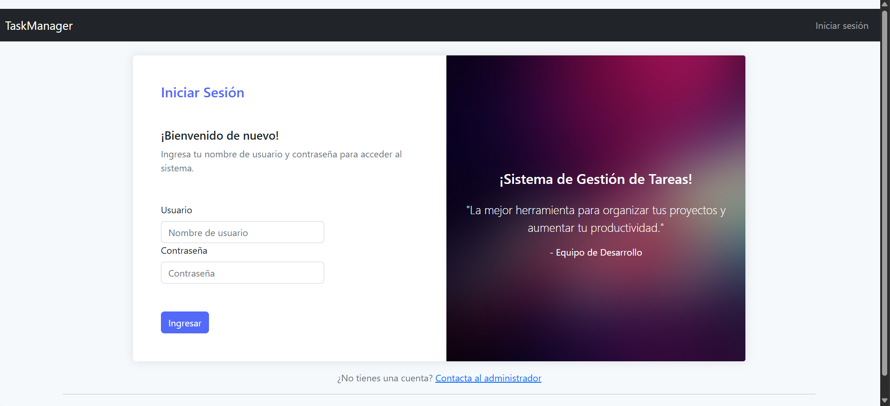
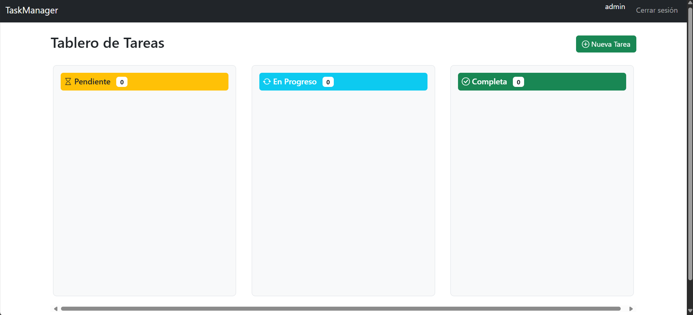
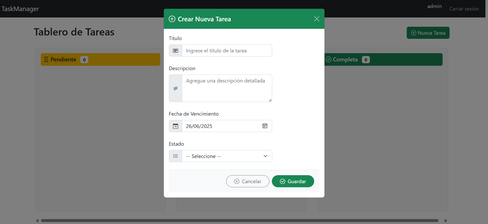
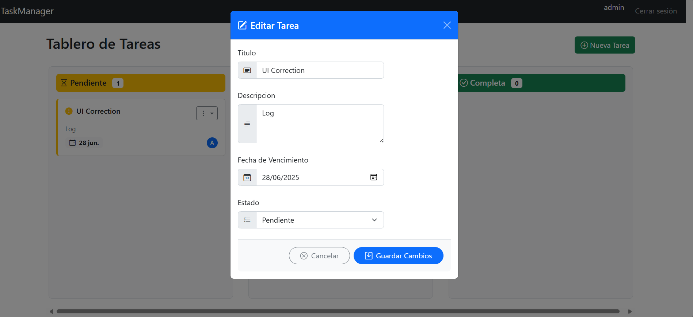
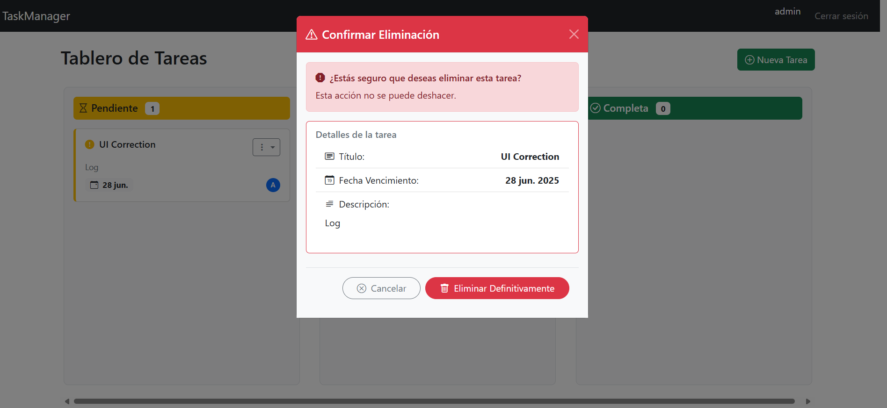

# TaskManager  
### Sistema de Gestión de Tareas — Prueba Técnica

Este proyecto es una prueba técnica que consiste en el desarrollo de un sistema web para la **gestión de tareas**, implementado con **ASP.NET MVC 5  (.NET Framework 4.7 )**. El sistema permite a los usuarios autenticarse, visualizar sus tareas, y gestionarlas mediante un tablero con una interfaz moderna, validaciones en cliente y servidor, y operaciones CRUD completas.

---

## ✅ Funcionalidades Implementadas

### 1. **Autenticación**
- Registro e inicio de sesión con validación.
- Restricción de acceso a vistas para usuarios autenticados.

### 2. **Gestión de Tareas**
- Crear, editar y eliminar tareas.
- Visualización de tareas en un tablero tipo **Kanban** por estado.
- Cambio de estado mediante **Drag & Drop** (usando SortableJS).
- Filtros por estado y fecha de vencimiento.
- Ordenamiento visual intuitivo.

### 3. **Campos de Tarea**
- Título (texto)
- Descripción (texto)
- Fecha de asignación (se asigna automáticamente desde el sistema)
- Fecha de vencimiento (editable por el usuario)
- Estado: Lista con valores: `Pendiente`, `En Progreso`, `Completa`

---

## ✅ Validaciones Aplicadas

- **Título obligatorio** (validador en cliente y servidor)
- **Fecha de asignación** generada automáticamente (no editable)
- **Fecha de vencimiento** debe ser posterior a la fecha actual

---

## 🧠 Principios SOLID aplicados

- **S**: Responsabilidad Única – Separación clara de controladores, vistas y lógica de acceso a datos  
- **O**: Abierto/Cerrado – Las entidades están diseñadas para extensión sin modificación directa  
- **L**: Sustitución de Liskov – Controladores y servicios funcionan con tipos base  
- **I**: Segregación de Interfaces – Interfaces desacopladas para autenticación y repositorio  
- **D**: Inversión de Dependencias – Uso de inyección de dependencias para servicios clave  

---

## 🛠️ Tecnologías Utilizadas

### Backend
- ASP.NET MVC 5 (con Razor) 
- C#
- Entity Framework 6 (Code First)
- SQL Server LocalDB

### Frontend
- HTML5, CSS3
- Bootstrap 5 + Bootstrap Icons
- jQuery + AJAX
- SortableJS (Drag & Drop Kanban)

---
## 🗃️ Estructura de Base de Datos

```sql
CREATE TABLE Tareas (
    TareaId INT PRIMARY KEY IDENTITY,
    Titulo NVARCHAR(100) NOT NULL,
    Descripcion NVARCHAR(500),
    Estado NVARCHAR(20) CHECK (Estado IN ('Pendiente', 'EnProgreso', 'Completa')),
    FechaAsignacion DATETIME NOT NULL,
    FechaVencimiento DATE NOT NULL,
    UsuarioId INT FOREIGN KEY REFERENCES Usuarios(UsuarioId)
);
```
---
## ⚙️ Cómo ejecutar el proyecto 

1.-Clona el repositorio:

```
git clone https://github.com/tuusuario/TaskManager.git
```
2.-Abre la solución en Visual Studio (compatible con .NET Framework 4.7).

3.-Asegúrate de tener SQL Server LocalDB o configurar la cadena de conexión en Web.config para tu servidor SQL.

Ejecuta el proyecto (Ctrl + F5).

EF Code First creará la base de datos automáticamente.

---
## 🗃️ Base de Datos

Se incluye el archivo [`TaskManager_DB_Script.sql`](Database/TaskManager_DB_Script.sql) con la estructura y restricciones de la base de datos utilizadas en este proyecto.

### Tablas incluidas:

- `Usuarios`: almacena las credenciales básicas de autenticación.
- `Tareas`: gestiona las tareas asignadas por usuario, con validaciones y fechas clave.

### Cómo usarlo:

1. Abre **SQL Server Management Studio (SSMS)**.
2. Crea una base de datos nueva llamada `TaskManager`.
3. Abre el archivo `TaskManager_DB_Script.sql` y ejecútalo sobre esa base.
4. ¡Listo! Ya tienes la estructura preparada para ejecutar el proyecto.

> 💡 El proyecto también puede crear la base automáticamente mediante Entity Framework Code First si se ejecuta con LocalDB.

---
## 🖼️ Capturas de pantalla

### 👨‍💻 Vista del Logging 


### 🟦 Vista general del tablero Kanban


### ✳️ Modal de creación de tarea


### 🎨 Modal de edición de tarea


### 🔴 Modal de eliminación de tarea


---
## 👨‍💻 Autor

**Nazario Monroy**  
Desarrollador Fullstack especializado en .NET  
🔗 [LinkedIn](https://www.linkedin.com/in/nazario-monroy98)
